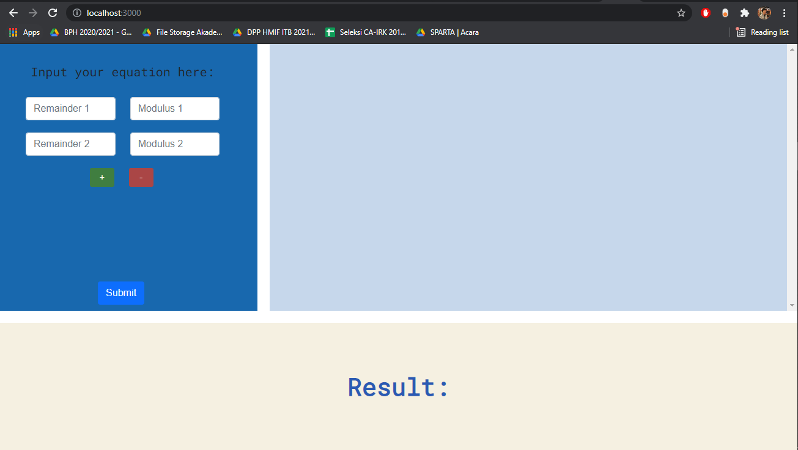

# Chinese Remainder Problem Solver

- This project built to fulfill one of task in IRK assistant lab selection IF ITB
- This project was bootstrapped with [Create React App](https://github.com/facebook/create-react-app).

## Image of Site:

## How to Run Local
1. Open your command line and copy this repository to anywhere you like
2. Move your current directory on command line to inside of this repository folder
3. Type on your command line `npm install` to add dependencies (node_modules)
4. After success adding dependencies, type `npm start`

## How to Deploy
Not yet.

## Author
Muhammad Tito "grevi" Prakasa
